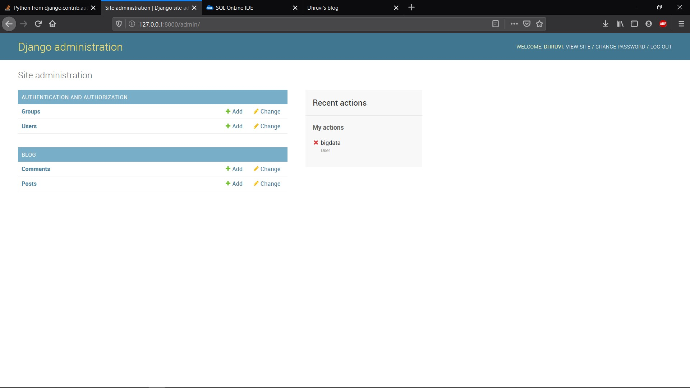
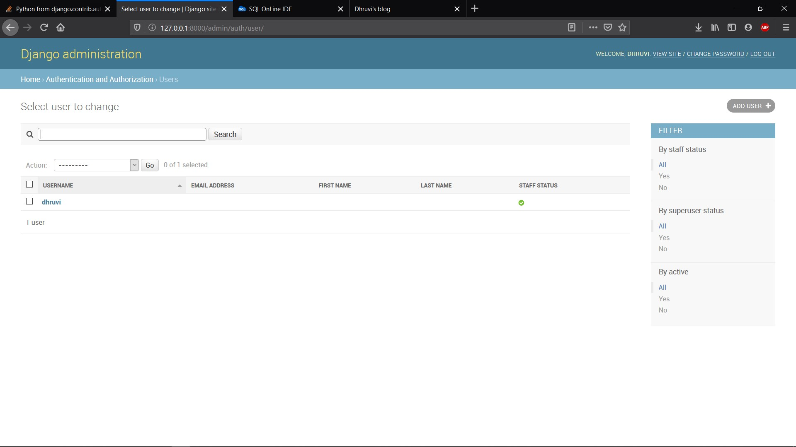
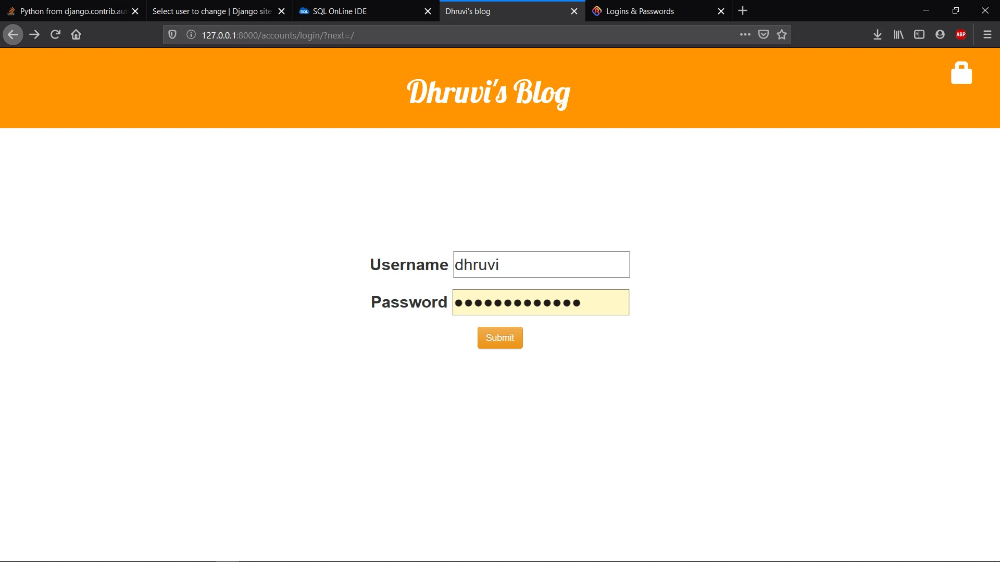
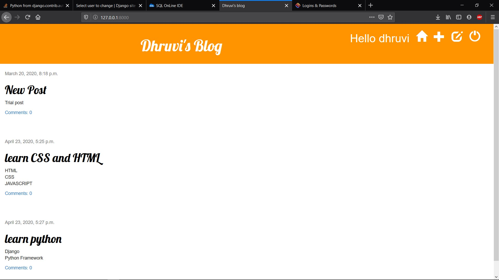
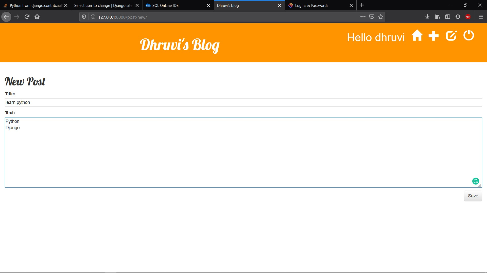

# Dhruvi's Blog
It's a Blog app from django with sqliteDB.

Some screenshots from the app are given below

 
It's the admin home page. Here various options are given to admin.

 
Here it's the admin page where you can see the list of users of your blog app.

 
This is the main blog login page

 
This is the blog home page where New posts are seen.

 
This screenshot shows how you can write your blog and save it.

